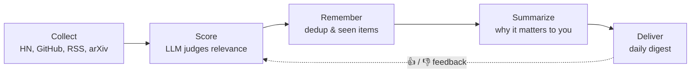

# Tech Radar Agent

> 🚧 **Work in progress.** The project is being built step by step and is not usable yet. See the [roadmap](#roadmap) for the current status.

A personal tech-watch agent that scans developer news sources every day, uses an LLM to decide what is actually relevant to *you*, and delivers a short, curated digest.

It is built **from scratch, without any agent framework** (no LangChain, no CrewAI). The goal is to understand what makes an agent more than a script: a loop of collecting, judging, remembering and adapting.

## Why

Hacker News, GitHub, arXiv and tech blogs produce far more content than anyone can read. Keyword filters are too blunt: they miss relevant articles and let noise through. Tech Radar Agent reads everything for you and keeps only what matches your interests, explaining in a couple of sentences why each item is worth your time.

## How it works



1. **Collect**: fetch raw content from several sources (Hacker News API, GitHub, RSS feeds).
2. **Score**: an LLM rates each item against your interest profile, not just keywords.
3. **Remember**: store everything in SQLite to avoid duplicates and never show the same item twice.
4. **Summarize**: write a short summary explaining why the item matters to you.
5. **Deliver**: send a daily digest (email or Discord), triggered automatically by GitHub Actions.
6. **Adapt**: your feedback on past digests is fed back into the scoring, so the agent improves over time.

## Tech stack

| Component | Role | Status |
|---|---|---|
| Python 3.12 + [uv](https://docs.astral.sh/uv/) | Language, dependency and Python version management | ✅ |
| httpx | HTTP requests to source APIs | ✅ |
| feedparser | RSS / Atom feeds parsing | ✅ |
| PyYAML | Interest profile and source configuration | ✅ |
| SQLite | The agent's memory | 🔜 |
| LLM API | Relevance scoring and summarization | 🔜 |
| GitHub Actions | Daily schedule | 🔜 |

## Getting started

> The agent does not do anything useful yet. These steps set up the development environment.

**Prerequisite:** [uv](https://docs.astral.sh/uv/getting-started/installation/) installed.

```bash
git clone https://github.com/AntoineRb/tech_radar_agent.git
cd tech_radar_agent
uv sync
uv run tech-radar-agent
```

uv installs the right Python version and all dependencies automatically, based on `.python-version` and `uv.lock`.

## Project structure

```text
tech_radar_agent/
├── src/tech_radar_agent/
│   ├── models.py        # the Article data model
│   ├── collectors/      # one module per source
│   └── storage/         # SQLite persistence
├── config/
│   └── interests.yaml   # your interest profile and sources
├── data/                # local SQLite database (git-ignored)
├── docs/                # architecture, decision log, dev guides
└── pyproject.toml
```

See the [documentation](docs/README.md) for architecture details and design decisions.

## Roadmap

- [ ] **Step 1: Collection.** Project setup, `Article` model, SQLite storage, collectors for Hacker News, RSS and GitHub.
- [ ] **Step 2: Agent loop.** LLM scoring against the interest profile, relevance summaries, error handling and rate limiting.
- [ ] **Step 3: Memory and delivery.** Cross-source deduplication, sent-item tracking, daily digest by email or Discord, scheduling with GitHub Actions.
- [ ] **Step 4: Feedback and adaptation.** 👍 / 👎 feedback on digest items, feedback-aware scoring, detection of recurring "hot topics".

## Background

This project follows the [Hugging Face Agents Course](https://huggingface.co/learn/agents-course). It is a hands-on way to apply the core concepts (tool use, memory, the perception → decision → action loop) to a tool I actually use every day.
