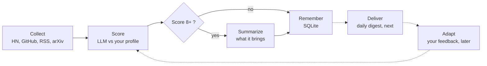

# Tech Radar Agent

[](https://github.com/AntoineRb/tech_radar_agent/actions/workflows/tests.yml)


[](LICENSE)

**An AI agent that reads developer news for you, and keeps only what matters to *you*.**

Every day it collects articles from Hacker News, GitHub, tech blogs and arXiv, asks an LLM to judge each one against your interest profile, and summarizes the best. It is written **from scratch, without any agent framework**: no LangChain, no CrewAI, no SDK. The whole agent loop is one readable file, every design choice is documented, and the key ones are measured.

> **v0.2.0**: collection, LLM scoring and summaries work end to end, with a local model ([Ollama](https://ollama.com)) or any OpenAI-compatible API. The daily digest by email or Discord comes next.

## See it in action

One command collects from 17 sources, then scores what is new:

```text
$ uv run --env-file .env tech-radar-agent
INFO    tech_radar_agent: hackernews: 26 new articles
INFO    tech_radar_agent: lobsters: 12 new articles
INFO    tech_radar_agent: arxiv-cs-ai: 15 new articles
...
INFO    tech_radar_agent: Done: 218 articles collected, 61 new, 0/17 sources failed
INFO    tech_radar_agent: Scoring with qwen3.6:latest: 3/3 articles scored (0 summarized, 0 summary failures), 0 failed
```

Real results from the first runs (qwen3.6, local, October 2026). The profile asks for French, so the agent writes in French:

| Score | Article | Matched interests | Why, according to the agent |
|:---:|---|---|---|
| **8** | The Real Python Podcast #313: Python 3.15, Exploring the New Features | `python` | Article technique sur les nouvelles fonctionnalités de Python 3.15, pertinent pour un développeur Python. |
| 7 | AI is changing developer work. Here are three skills to strengthen. | `ai-agents`, `dev-tooling` | Article sur l'impact de l'IA sur le développement, pertinent pour les agents IA mais manquant de profondeur technique. |
| 5 | Apple and a Hacker's Future | `apple` | Titre lié à Apple (intérêt moyen), mais le contenu semble être un essai d'opinion sans substance technique pour un développeur. |
| 2 | Reverse Engineering Comanche Terrain Maps | none | Sujet de rétro-informatique sans lien direct avec les intérêts techniques prioritaires du lecteur. |

Articles scored 8 or more also get a summary of **what they bring**, so you can decide without opening them:

> L'article annonce la sortie de Python 3.15 et présente des ressources d'apprentissage associées, notamment un tutoriel de démonstration écrit par Bartosz Zaczyński et un cours vidéo de Christopher Trudeau. Ces contenus couvrent les nouvelles fonctionnalités du langage.

Everything lands in SQLite, ready for the digest:

```bash
sqlite3 data/tech_radar.db "SELECT score, title, reason FROM articles WHERE score >= 8 ORDER BY scored_at DESC"
```

## An agent, without a framework

Frameworks hide the part worth understanding. Here the loop is plain Python: **perceive** (collect), **judge** (score), **decide** (threshold, retry or stop), **act** (summarize, save). This is its core, simplified from [`agent/loop.py`](src/tech_radar_agent/agent/loop.py):

```python
for stored in fetch_articles_to_score(conn, max_age_days, limit):     # recent, unscored, newest first
    try:
        score = call_with_retry(lambda: scorer.score(stored.article))  # temporary errors: wait, retry
    except (LlmTemporaryError, LlmFatalError):
        break                                                          # server down: stop, lose nothing
    except LlmError:
        continue                                                       # bad answer: skip this article

    summary = None
    if score.score >= threshold:
        summary = call_with_retry(lambda: summarizer.summarize(stored.article))

    save_score(conn, stored.id, score)                                 # committed at once
    if summary:
        save_summary(conn, stored.id, summary)
```



The LLM client is ~260 lines of `httpx` speaking the OpenAI chat completions format, so the same code runs against a local model or a remote API: only environment variables change.

## Design choices, measured

Each choice was tested against a real model before being kept. Details are in the [decision log](docs/decisions/README.md) (22 ADRs).

| Choice | Measurement |
|---|---|
| Turn the model's "thinking" off | **0.3 s** per call instead of 18 s: about 1 minute instead of 1 hour for 200 articles |
| Send the first 1,000 characters, not the whole article | less than 1 point of difference on a 0-10 score, **~45 % fewer tokens** on long articles (30 articles) |
| Validate the LLM's JSON strictly in code, rather than trusting a server-side schema | 0 invalid answers in ~200 calls, and the validation stays the real guarantee |
| Summary threshold at 8 | keeps about a third of the articles (25 articles measured); at 7, more than half pass |
| Retry only when a retry can change something | at temperature 0, a bad answer stays bad; a server outage does not |
| Score each article alone, never in batches | no article can inject instructions into another one's judgment |

## Security: collected content is data, never instructions

An agent that reads the web reads hostile text. The rules are in [`docs/security.md`](docs/security.md) and enforced by code and tests:

- **Prompt injection**: article text is cleaned (invisible and bidirectional characters removed), truncated, and isolated between delimiters in the user message. The system message holds only trusted instructions.
- **No tools for the LLM, enforced by code**: the client refuses tool options and rejects any answer containing a tool call.
- **The LLM's output is untrusted too**: the score is bounded, unknown interest ids are rejected, and a summary containing a link or HTML is rejected, never "cleaned up". Links shown to the reader always come from the database, never from the LLM.
- **Network**: HTTPS only, timeouts, 5 MB response cap, `http`/`https` URLs only, `yaml.safe_load` only.
- **Supply chain**: 3 runtime dependencies, a lockfile with hashes, `pip-audit` before dependency changes, GitHub Actions pinned to commit SHAs with a read-only token.

## Engineering

- **633 tests in ~0.3 s**, with no network and no LLM: fake HTTP servers, a fake LLM server, and hostile inputs (XXE feeds, `javascript:` links, prompt injection, links hidden by invisible characters).
- **Tests checked by injecting bugs**: 15 bugs planted one at a time in the agent loop and `main()`, every one caught (two of them only after strengthening the tests).
- **CI** on every pull request and push, with GitHub Actions.
- **Failure handling with clear outcomes**: one broken source never stops the others, an LLM outage never loses the day's collection, and exit codes tell CI what happened.
- **Documented**: architecture pages and one ADR per decision, under [`docs/`](docs/README.md).

## Getting started

**Prerequisites:** [uv](https://docs.astral.sh/uv/getting-started/installation/), and an LLM server speaking the OpenAI chat completions format: a local model with [Ollama](https://ollama.com), or a remote API.

```bash
git clone https://github.com/AntoineRb/tech_radar_agent.git
cd tech_radar_agent
uv sync
cp .env.example .env   # then set LLM_BASE_URL and LLM_MODEL (see docs/configuration.md)
uv run --env-file .env tech-radar-agent
```

uv installs the right Python version and every dependency from `uv.lock`. Without LLM settings, the run still collects, then skips scoring and exits with code `3`.

Describe what you care about in [`config/interests.yaml`](config/interests.yaml), in plain words:

```yaml
profile:
  about: >
    Software developer. Building AI agents from scratch in Python and following
    the tech industry closely. Interested in hands-on, technical content over hype.
  language: French
  interests:
    high:
      ai-agents: AI agents (architecture, tool use, memory, evaluation)
      llm: Large language models (new models, benchmarks, prompting, fine-tuning)
      python: Python (language, tooling, notable libraries)
  not_interested:
    - Opinion pieces with no technical substance
```

## Project structure

```text
tech_radar_agent/
├── src/tech_radar_agent/
│   ├── agent/           # the loop, scoring, summaries
│   ├── llm/             # LLM settings and client (httpx, no SDK)
│   ├── collectors/      # one module per source type
│   ├── storage/         # SQLite persistence
│   └── models.py        # the Article data model
├── config/
│   └── interests.yaml   # your interest profile and sources
├── docs/                # architecture, decision log, dev guides
├── tests/               # pytest suite
└── pyproject.toml
```

## Known limitations

- No digest is sent yet: results are in SQLite (v0.3.0).
- Summary faithfulness is not measured yet. In the example above, "Python 3.15 is (almost) here" became "announces the release". An evaluation set is planned.
- Articles without text (many Hacker News links) are judged on their title, source and domain only.
- Deduplication is by URL: the same story on two sites is not merged yet.

## Roadmap

- [x] **v0.1.0: Collection.** `Article` model, SQLite storage, collectors for Hacker News, RSS / Atom and GitHub, config-driven sources.
- [x] **v0.2.0: Agent loop.** LLM client, scoring against the interest profile, summaries, retries and failure handling, CI.
- [ ] **v0.3.0: Memory and delivery.** Sent-item tracking, daily digest by email or Discord, scheduling with GitHub Actions.
- [ ] **v0.4.0: Feedback and adaptation.** 👍 / 👎 on digest items, feedback-aware scoring, recurring "hot topics".
- [ ] **Alongside:** an LLM evaluation set to compare prompts and models reproducibly.

## How this project is built

Built in mentor mode with [Claude Code](https://claude.com/claude-code): I design and write the agent logic myself; Claude challenges the design one question at a time, reviews my code, and writes plumbing and tests when I ask. The working rules are in [`CLAUDE.md`](CLAUDE.md).

The project follows the [Hugging Face Agents Course](https://huggingface.co/learn/agents-course): a hands-on way to apply its core ideas (the perception, decision, action loop, memory, evaluation) to a tool I use every day.

## License

[MIT](LICENSE) © 2026 Antoine ROBERT
