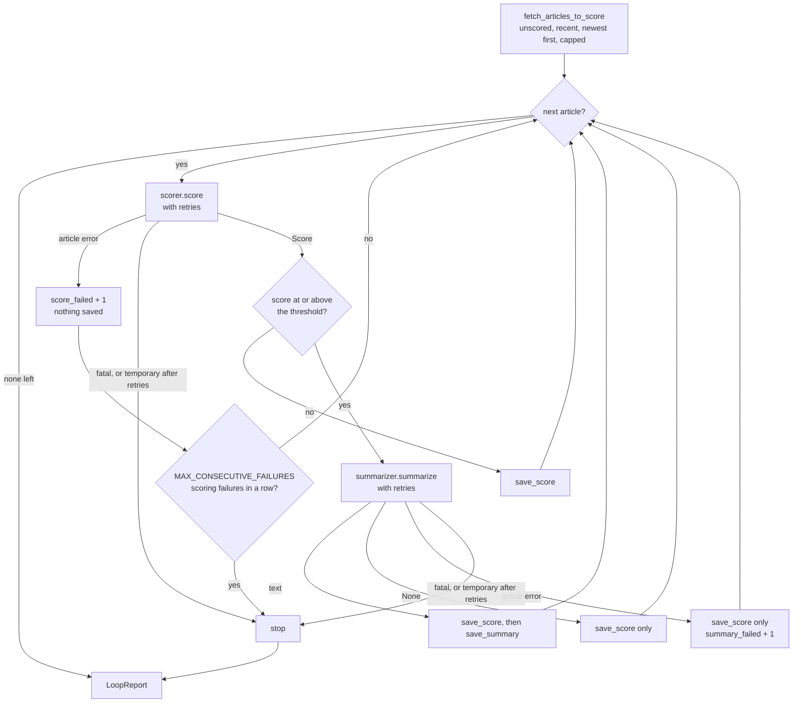

# Agent loop

Defined in [`src/tech_radar_agent/agent/loop.py`](../../src/tech_radar_agent/agent/loop.py) and called by `main()` right after the collection. It takes the articles waiting to be scored, [scores](scoring.md) them, [summarizes](summary.md) the best ones, and saves each result as soon as it has it. It decides what to do when the LLM fails: skip the article, retry, or stop.

The loop is written by hand, without an agent framework ([ADR 0001](../decisions/0001-no-agent-framework.md)). `Scorer` and `Summarizer` never catch errors: every decision is taken here.

## One article, step by step



Each `save_*` commits at once, so a stop or a crash never loses what was already saved.

## API

```python
from tech_radar_agent.agent.loop import score_and_summarize

report = score_and_summarize(conn, scorer, summarizer, agent_settings, model=llm_settings.model)
```

| Function | Returns | Raises |
|---|---|---|
| `score_and_summarize(conn, scorer, summarizer, settings, *, model, sleep=time.sleep)` | `LoopReport` | no LLM exception: a stop is reported in `stop_reason`. Any other exception is a bug and propagates |
| `call_with_retry(call, *, sleep=time.sleep)` | what `call()` returns | the last `LlmTemporaryError` once every attempt failed; any other exception at once, without retrying |

`model` is stored in `scored_with`. `sleep` is injected so tests record the waits instead of sleeping.

## Failure handling

The [client](../decisions/0012-llm-client-contract.md) classifies errors; the loop decides ([ADR 0019](../decisions/0019-failure-handling.md), [ADR 0021](../decisions/0021-partial-failures-in-the-loop.md)).

| Error | During scoring | During the summary |
|---|---|---|
| About one article: `LlmError`, `ScoreValidationError`, `SummaryValidationError` | Skip the article, nothing saved: it is retried at the next run. `MAX_CONSECUTIVE_FAILURES` (5) in a row stop the loop | Save the score without a summary, for good: at temperature 0 a retry would give the same answer |
| `LlmTemporaryError` | Retried after 2 s, then 8 s (or the server's `Retry-After`, capped at 60 s). Still failing: stop | Same |
| `LlmFatalError` | Stop at once | Stop at once |

- A **stop** saves nothing for the article it happened on, even during its summary. The article stays unscored and is processed again, from scratch, at the next run. This costs one extra scoring call after an outage, and needs no extra column or query: `fetch_articles_to_score` already picks it up.
- Only **scoring** failures count towards the 5 in a row. A broken summary prompt would not stop the run, but it shows in `summary_failed` and in the warnings.
- `Retry-After` is capped because the server is not a trusted source: `Retry-After: 86400` must not block the run for a day.
- Log lines name the article and the error, for example `Scoring failed for 'Faster JSON parsing': ScoreValidationError (LLM answer is not valid JSON)`. Error messages never echo the LLM answer, so they are safe to log.

## Run report

```python
@dataclass(frozen=True)
class LoopReport:
    total: int            # articles to score when the loop started
    scored: int           # scored and saved, whatever happened to their summary
    score_failed: int     # scoring failed for this article: left unscored, retried next run
    summarized: int       # scored articles whose summary was saved
    summary_failed: int   # scored articles whose summary failed: score kept, no summary
    stop_reason: str | None = None

    stopped: bool         # property: stop_reason is not None
    remaining: int        # property: total - scored - score_failed
```

- Each article is in exactly one of `scored`, `score_failed` and `remaining`.
- `summarized + summary_failed <= scored`: articles below the threshold, or whose summary is `None`, are in neither.
- `remaining` holds the articles never reached, plus the one a fatal or temporary stop happened on. After 5 scoring failures in a row, the last failed article is in `score_failed` instead.

## In `main()`

`main()` collects first, then calls `score_new_articles()`, which:

1. reads `LLM_*` and `AGENT_*` from the environment ([configuration](../configuration.md)). They are read **after** the collection on purpose: a missing or invalid LLM setup must not cost the day's collection ([ADR 0018](../decisions/0018-agent-loop-scope.md)). An invalid setting logs `Scoring skipped…` and ends the run with exit code 3;
2. opens one `LlmClient` for the whole run, builds one `Scorer` and one `Summarizer` (each system prompt is built once), and runs the loop;
3. logs one summary line, for example `Scoring with qwen3.6:latest: 38/40 articles scored (12 summarized, 0 summary failures), 2 failed`, with `stopped early: N left for the next run` after a stop.

Scoring also runs when every source failed: articles left unscored by an earlier run still get scored.

| Exit code | Meaning |
|---|---|
| `0` | Collection and scoring completed (some sources or articles may have failed) |
| `1` | Every source failed. Reported first, even if scoring also stopped |
| `2` | Invalid configuration file: nothing was collected, no LLM call |
| `3` | The collection is saved, but scoring was skipped (invalid LLM or agent settings) or stopped early |

## Tests

- `tests/agent/test_loop.py` (28 tests): fake `Scorer` / `Summarizer` that answer or raise per article title, a real SQLite database in `tmp_path`, and `sleep=waits.append`. Every run checks the report invariants. Checked by injecting 9 bugs into `loop.py` (missing wait, uncapped `Retry-After`, `>` instead of `>=`, counter never reset, `except Exception`…): each one makes at least one test fail.
- `tests/test_main.py`: the real `LlmClient`, `Scorer`, `Summarizer` and loop, with only the HTTP transport replaced by a fake LLM server. Covers scoring after the collection, invalid settings, fatal errors, unscored articles picked up at the next run, exit code precedence, and the API key never logged.

## What is left

- The digest that shows these results, and a "sent" status so an article is never sent twice (v0.3.0).
- If summaries turn out to be missing in real digests, a query that retries missing summaries could be added (option C in [ADR 0021](../decisions/0021-partial-failures-in-the-loop.md)).
