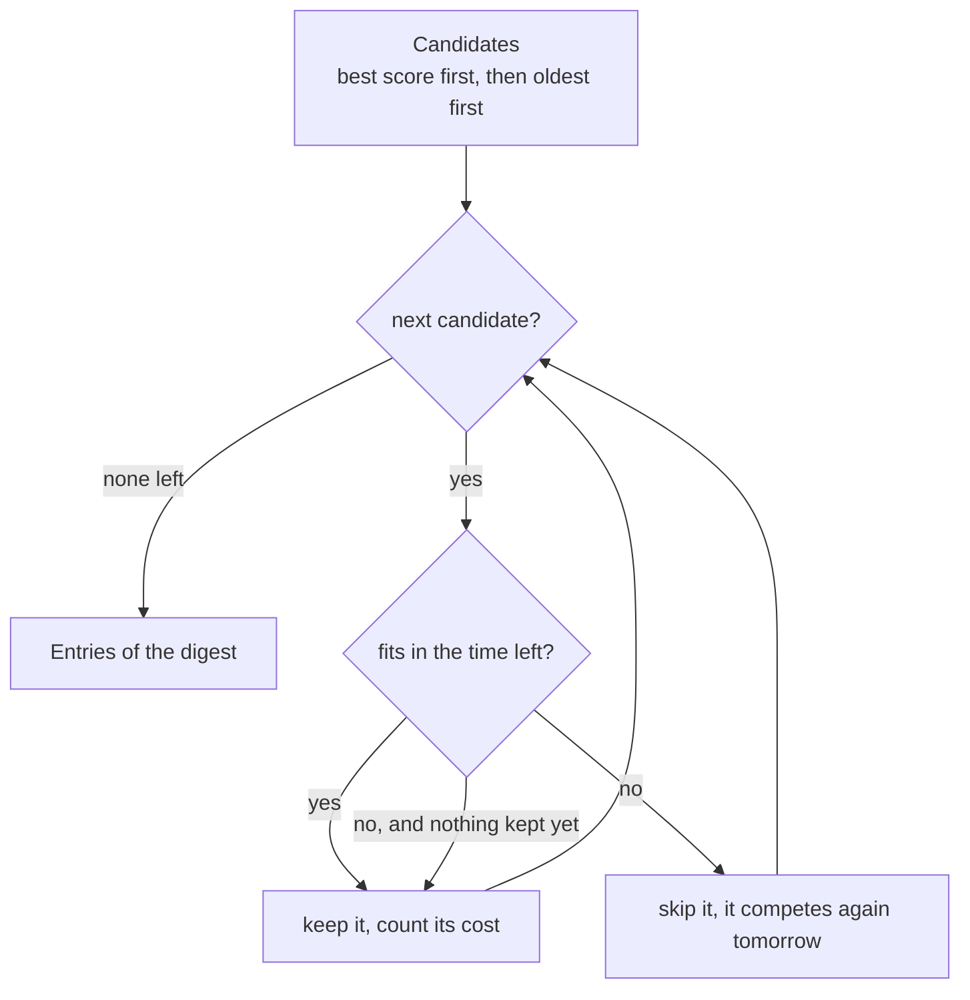

# Digest

The digest is the agent's final decision: which of the day's good articles deserve the reader's attention. It is built in three steps:

1. **Candidates**, from the database: `fetch_digest_candidates` ([storage](storage.md)) returns the articles scored at or above the threshold, not sent yet and recent enough, already in selection order.
2. **Selection** within a reading-time budget: [`agent/digest.py`](../../src/tech_radar_agent/agent/digest.py), described below.
3. **Rendering** in Telegram HTML: [`agent/render.py`](../../src/tech_radar_agent/agent/render.py), described below.
4. **Delivery** on Telegram: [`delivery/telegram.py`](../../src/tech_radar_agent/delivery/telegram.py), described below ([ADR 0026](../decisions/0026-telegram-delivery.md)). Wiring it into `main()` and the daily run come next. The articles are marked as sent (`mark_sent`) only once the digest was delivered.

The fixed labels (section titles, "Why:", the date) come from `i18n/` in the reader's language, with an English fallback ([ADR 0025](../decisions/0025-digest-labels-in-language-files.md)).

The design decisions are in [ADR 0023](../decisions/0023-digest-selection.md) (selection) and [ADR 0024](../decisions/0024-digest-on-telegram-with-folded-summaries.md) (Telegram, display, reading cost).

## Selection within a reading-time budget

The reader sets a time, not a number of articles: `digest.reading_time_minutes` in [`config/interests.yaml`](../configuration.md) (5 by default, 1 to 30). It is the time to **scan the digest and decide what to unfold or open**, not to read the articles.



| Function | Returns |
|---|---|
| `reading_seconds(candidate)` | Estimated seconds to scan one entry: words of what is visible by default, the title and the reason, at `READING_SPEED_WPM` (200), plus `ENTRY_OVERHEAD_SECONDS` (3) per entry. The folded summary is never counted |
| `select_entries(candidates, budget_minutes)` | The candidates kept, in the order given. Empty only when there is no candidate |

Rules:

- Entries with and without a summary cost the same, about 12 s: unfolding a summary is time the reader chose to spend. One budget is shared, and a 10/10 without summary still comes before an 8 with one. With this cost, 5 minutes holds about 25 entries: on a normal day the threshold does the filtering, and the budget caps busy days.
- An entry that does not fit is **skipped, and selection goes on**: a shorter one further down may still fit. A skipped article is not marked as sent, so it competes again for the next digest.
- An entry whose cost is exactly the time left is kept.
- **Never empty while there is a candidate**: the first one, the best, is always kept, even beyond the budget. With today's limits (300-character title and reason), the longest possible entry costs about 33 s, under the 1-minute minimum: this rule is a guard for future changes.

### More time means more of the best, not always more entries

The selection is greedy: it takes the best candidates first. So a larger budget can hold **fewer** entries, when it lets well-ranked long ones in that take the room of several lower-ranked short ones. With six candidates costing 9, 54, 54, 6, 6 and 6 seconds, in that order:

| Budget | Entries |
|---|---|
| 1 min | 9, 6, 6, 6 (both 54 s entries skipped) |
| 2 min | 9, 54, 54 (the well-ranked long entries fit, the short ones no longer do) |

This is intended: the digest favors the best-ranked articles over the number of articles. With realistic costs (at most about 33 s per entry) it has become rare: a search found no case with up to 8 candidates between 1 and 2 minutes. What always holds: the total never exceeds the budget (except for the forced first entry), and a larger budget keeps everything a smaller one kept before its first skip. Both are checked by tests.

## Rendering in Telegram HTML

```text
🗞 Tech Radar · Tuesday 6 October
12 articles · about 3 min to scan

📖 TO READ
🟢 9/10 · Python 3.15: Cool New Features         (the title links to the article)
#python #dev_tooling · realpython
Why: Technical article on the new features of Python 3.15...
┃ The article presents the new features...       (folded summary: one tap unfolds it)
💬 Discussion                                     (Hacker News, when there is one)

🔗 ALSO WORTH A LOOK
🟡 8/10 · Apple and a Hacker's Future
#apple · hackernews
Why: Title related to Apple...
```

| Function | Returns |
|---|---|
| `render_digest(entries, labels, today)` | A list of **blocks**: the header (date, number of articles, minutes to scan rounded up), then each non-empty section title followed by one block per entry. Empty for no entry |
| `render_empty_report(labels, threshold, collected, scored, best)` | The one-line report of a day with no candidate |
| `render_entry(candidate, labels)` | One entry: badge (🟢 from 9, 🟡 below), score, title linking to the article, hashtags (`ai-agents` becomes `#ai_agents`, since a dash ends a Telegram hashtag), source, the reason, the folded summary, the discussion link |

- **Blocks, not one string**: every block is complete HTML, so delivery can pack blocks into messages of at most 4096 characters without ever cutting inside a tag (Telegram would reject the whole message).
- **Everything is escaped** with `html.escape(..., quote=True)`: titles, sources, reasons, summaries, tags, and the labels too (a translated file is text nobody here wrote). URLs are escaped inside `href`, so a quote cannot open another attribute.
- **Links come only from the database.** The discussion link comes from `extra`, which is not validated at collection time: it is kept only if it is a string and a safe web URL, and dropped when it is the article URL itself (an "Ask HN" post).
- Labels come from `i18n/` in the reader's language ([ADR 0025](../decisions/0025-digest-labels-in-language-files.md)); `today` is passed in, never read from the clock, so the output can be tested.

## Delivery on Telegram

| Function | Does |
|---|---|
| `load_telegram_settings()` | Reads `TELEGRAM_BOT_TOKEN` (format checked) and `TELEGRAM_CHAT_ID` (positive: a private chat, never a group) |
| `pack_messages(blocks)` | Packs whole blocks into as few messages as possible, each within 4096 UTF-16 code units, and keeps the article ids of each message |
| `TelegramClient(settings).send(text)` | Sends one HTML message, without link preview. Raises `TelegramError` (this message refused), `TelegramTemporaryError` or `TelegramFatalError`, never an httpx error |
| `send_digest(client, messages, on_sent)` | Sends in order and calls `on_sent(article_ids)` after each message Telegram confirmed. Returns a `DeliveryReport` (total, sent, failed, stop reason) |

- **Marked message by message**: the caller marks the articles of each confirmed message as sent, so a half-sent digest never repeats itself the next day. Nothing is marked before Telegram confirms.
- **Failures**: a refused message (400) is skipped and the others go on; a temporary error (429 with `retry_after`, 5xx, network) is retried twice, then sending stops; a fatal one (401, 403 bot blocked, 404) stops at once. What was not sent competes again for the next digest.
- **The token never leaks**: it is in every API URL, and httpx puts URLs in its error messages and its own request logs. Errors are rebuilt from their type only (`raise ... from None`, not even chained), a filter replaces the token in httpx's logs while the client is open, Telegram's descriptions are checked, and redirects are never followed.

## Tests

`tests/agent/test_digest.py` builds candidates with a known cost (a one-word title plus a reason of a chosen number of words, and a summary that must change nothing; the helper checks the cost it produces). It covers the cost rules (title and reason counted, the summary never counted whatever its length, spacing, fixed cost), the budget rules (exact fit, skip and go on, forced first entry, order kept, input never modified), and the properties above on a realistic mix of entries. `tests/agent/test_render.py` checks the layout, both languages, singular and plural, minutes rounded up, the section order, and hostile text in every field (with `html.parser`, every block must be complete HTML using only Telegram's tags). `tests/delivery/test_telegram.py` runs against a fake Telegram server: settings, packing (limit, emojis, ids), error classes, retries, partial sending, and the token in every failure path (error text, full traceback, httpx's own logs, Telegram's description). Checked by injecting bugs into `digest.py` (`<` instead of `<=`, `break` instead of `continue`, the summary counted again, the reason or the title forgotten, the original inverted formula…): each one makes tests fail; and 13 into `render.py` (each escaping removed, `quote=False`, an unsafe or repeated discussion link, minutes rounded down, sections swapped…), all caught; and 13 into `delivery/telegram.py` (four ways to leak the token, a group chat accepted, a 403 not fatal, `retry_after` uncapped, confirmed messages never marked…), all caught.
