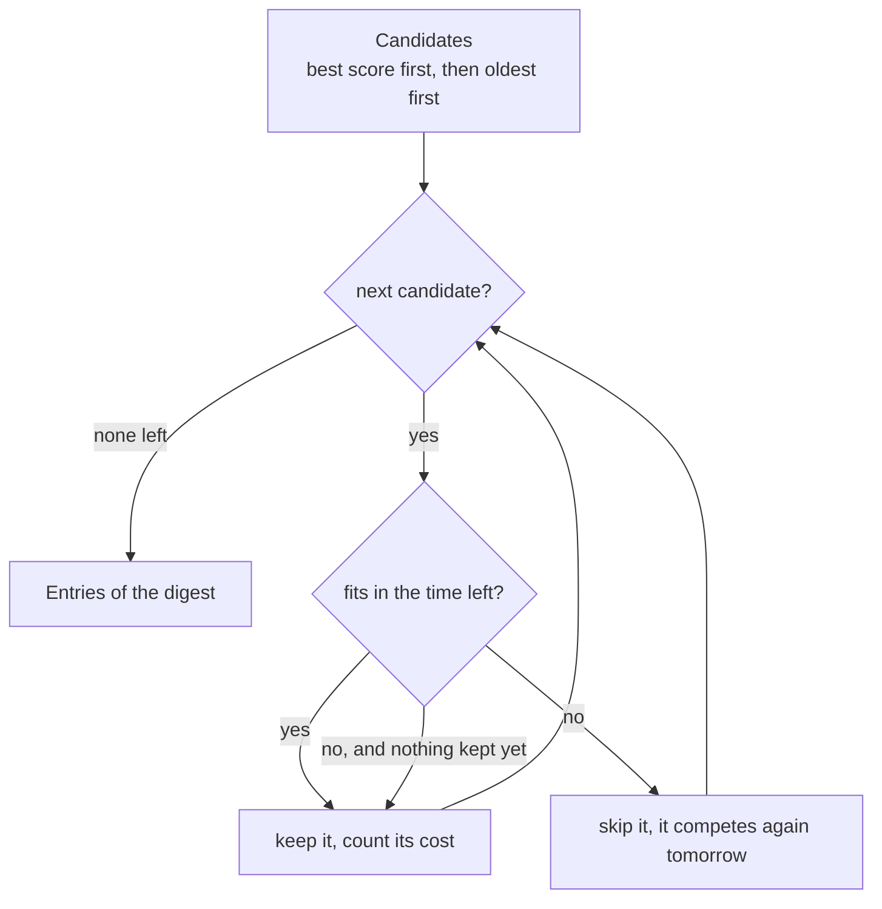

# Digest

The digest is the agent's final decision: which of the day's good articles deserve the reader's attention. It is built in three steps:

1. **Candidates**, from the database: `fetch_digest_candidates` ([storage](storage.md)) returns the articles scored at or above the threshold, not sent yet and recent enough, already in selection order.
2. **Selection** within a reading-time budget: [`agent/digest.py`](../../src/tech_radar_agent/agent/digest.py), described below.
3. **Rendering and delivery**: planned (v0.3.0). The articles are marked as sent (`mark_sent`) only once the digest was delivered.

The design decisions are in [ADR 0023](../decisions/0023-digest-selection.md).

## Selection within a reading-time budget

The reader sets a time, not a number of articles: `digest.reading_time_minutes` in [`config/interests.yaml`](../configuration.md) (5 by default, 1 to 30). It is the time to **read the digest and decide what to open**, not to read the articles.

| Function | Returns |
|---|---|
| `reading_seconds(candidate)` | Estimated seconds to read one entry: words of the title plus the summary (or the reason when there is no summary), at `READING_SPEED_WPM` (200), plus `ENTRY_OVERHEAD_SECONDS` (3) per entry |
| `select_entries(candidates, budget_minutes)` | The candidates kept, in the order given. Empty only when there is no candidate |

Rules:

- A summary costs about 20 to 30 seconds and an entry without summary about 5, so both kinds share one budget: links cannot crowd summaries out, and a 10/10 without summary still comes before an 8 with one.
- An entry that does not fit is **skipped, and selection goes on**: a shorter one further down may still fit. A skipped article is not marked as sent, so it competes again for the next digest.
- An entry whose cost is exactly the time left is kept.
- **Never empty while there is a candidate**: the first one, the best, is always kept, even beyond the budget. With today's limits (300-character title, 600-character summary), the longest possible entry costs about 57 s, under the 1-minute minimum: this rule is a guard for future changes.

### More time means more of the best, not always more entries

The selection is greedy: it takes the best candidates first. So a larger budget can hold **fewer** entries, when it lets well-ranked long ones in that take the room of several lower-ranked short ones. With six candidates costing 9, 54, 54, 6, 6 and 6 seconds, in that order:

| Budget | Entries |
|---|---|
| 1 min | 9, 6, 6, 6 (both 54 s entries skipped) |
| 2 min | 9, 54, 54 (the well-ranked long entries fit, the short ones no longer do) |

This is intended: the digest favors the best-ranked articles over the number of articles. What always holds: the total never exceeds the budget (except for the forced first entry), and a larger budget keeps everything a smaller one kept before its first skip. Both are checked by tests.

## Tests

`tests/agent/test_digest.py` builds candidates with a known cost (a one-word title plus a summary of a chosen number of words; the helper checks the cost it produces). It covers the cost rules (summary or reason, spacing, fixed cost), the budget rules (exact fit, skip and go on, forced first entry, order kept, input never modified), and the properties above on a realistic mix of entries. Checked by injecting 9 bugs into `digest.py` (`<` instead of `<=`, `break` instead of `continue`, the reason read instead of the summary, the original inverted formula…): each one makes tests fail.
