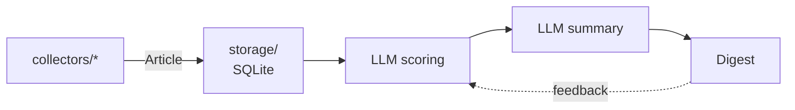

# Architecture overview

Tech Radar Agent runs a simple loop once a day: **collect → score → summarize → deliver**, with feedback flowing back into scoring. The loop is written by hand, without an agent framework (see [ADR 0001](../decisions/0001-no-agent-framework.md)).

## Pipeline



| Stage | Status | Where |
|---|---|---|
| Data model | ✅ Done | `models.py` |
| Storage | ✅ Done | `storage/` |
| Collection: Hacker News, RSS / Atom, GitHub | ✅ Done | `collectors/` |
| Orchestration (`main()`) and config | ✅ Done | `__init__.py`, `config.py`, `config/interests.yaml` |
| LLM settings (local or remote) | ✅ Done | `llm/settings.py`, `.env.example` |
| LLM client (no tools, strict response checks) | ✅ Done | `llm/client.py` |
| Scoring: prompts and answer validation | ✅ Done, not wired into `main()` yet | `agent/scoring.py` ([details](scoring.md)) |
| Summary: what the article brings, links and HTML rejected | ✅ Done, not wired into `main()` yet | `agent/summary.py` ([details](summary.md)) |
| Agent loop: threshold, retries, storing results, wiring into `main()` | 🔜 Next | `agent/` |
| Digest and delivery | Planned | — |
| Feedback | Planned | — |

## Code layout

The project uses the `src` layout generated by `uv init --package`.

```text
src/tech_radar_agent/
├── __init__.py      # main(): orchestrates the pipeline
├── config.py        # loads and checks config/interests.yaml
├── models.py        # Article: the data that flows through the pipeline
├── sanitize.py      # cleaning and validation of untrusted collected data
├── agent/
│   ├── scoring.py   # Scorer: prompts, LLM call, answer validation (depends on llm/, never the reverse)
│   ├── summary.py   # Summarizer: summary prompt, LLM call, answer validation (no links, no HTML)
│   └── settings.py  # AGENT_* variables: scoring window, cap per run, summary threshold
├── llm/
│   ├── settings.py  # LLM location and tuning (LLM_* variables) from the environment
│   ├── client.py    # LlmClient: OpenAI-compatible chat completions over httpx
│   └── __main__.py  # python -m tech_radar_agent.llm: checks the LLM setup
├── collectors/
│   ├── __init__.py  # registry: config type -> collector class, build_collector()
│   ├── base.py      # Collector base class, shared HTTP client and helpers
│   ├── github.py
│   ├── hackernews.py
│   └── rss.py
└── storage/
    ├── __init__.py  # public API: connect, save_articles
    └── database.py  # SQLite schema and queries
config/interests.yaml  # interest profile and list of sources
data/                  # local SQLite database (git-ignored, kept with .gitkeep)
```

## A run, step by step

`uv run tech-radar-agent` calls `main()`, which:

1. Sets up logging. `httpx` is lowered to `WARNING`, otherwise every HTTP request would get its own log line.
2. Loads the [configuration](../configuration.md) and builds every collector. Any config error stops the run here, before any network call.
3. Opens the database, then runs the collectors one by one. Each source's articles are saved right away, so a later crash loses nothing.
4. Logs a summary: articles collected, new articles, failed sources.

A source that raises is logged with its traceback and skipped, and the other sources keep running.

| Exit code | Meaning |
|---|---|
| `0` | Run completed, possibly with some failed sources |
| `1` | Every source failed |
| `2` | Invalid configuration, nothing was collected |

First real run (17 sources): 215 articles collected, 211 new, in about 7 seconds. A second run right after it added 0 new articles.

## Rules between modules

- Collectors only know about `Article`. They never touch the database.
- `storage/` is the only module that talks to SQLite.
- `main()` wires everything together. A failing source must not stop the others.
- `llm/` knows how to talk to an LLM; `agent/` knows how to judge articles. `agent/` depends on `llm/`, never the reverse.
- Article data only ever reaches the LLM inside the delimited user message, never in the system message.
