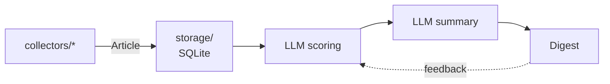

# Architecture overview

Tech Radar Agent runs a simple loop once a day: **collect → score → summarize → deliver**, with feedback flowing back into scoring. The loop is written by hand, without an agent framework (see [ADR 0001](../decisions/0001-no-agent-framework.md)).

## Pipeline



| Stage | Status | Where |
|---|---|---|
| Data model | ✅ Done | `models.py` |
| Storage | ✅ Done | `storage/` |
| Collection: Hacker News, RSS / Atom, GitHub | ✅ Done | `collectors/` |
| Orchestration (`main()`) and config | 🔜 Next | `__init__.py`, `config/interests.yaml` |
| Scoring and summary | Planned | — |
| Digest and delivery | Planned | — |
| Feedback | Planned | — |

## Code layout

The project uses the `src` layout generated by `uv init --package`.

```text
src/tech_radar_agent/
├── __init__.py      # main(): orchestrates the pipeline
├── models.py        # Article: the data that flows through the pipeline
├── sanitize.py      # cleaning and validation of untrusted collected data
├── collectors/
│   ├── __init__.py  # registry: config type -> collector class, build_collector()
│   ├── base.py      # Collector base class, shared HTTP client and helpers
│   ├── github.py
│   ├── hackernews.py
│   └── rss.py
└── storage/
    ├── __init__.py  # public API: connect, save_articles
    └── database.py  # SQLite schema and queries
config/interests.yaml  # interest profile and list of sources
data/                  # local SQLite database (git-ignored, kept with .gitkeep)
```

## Rules between modules

- Collectors only know about `Article`. They never touch the database.
- `storage/` is the only module that talks to SQLite.
- `main()` wires everything together. A failing source must not stop the others.
